# Fat-Bots in 2D 

> A gym like environment for fat-robots in a 2-D world.


# World

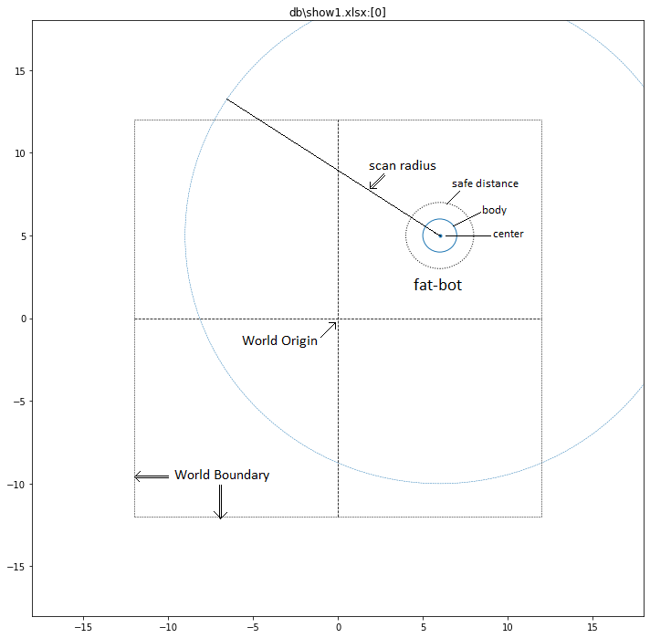

# Movement Model - Velocity and Speed

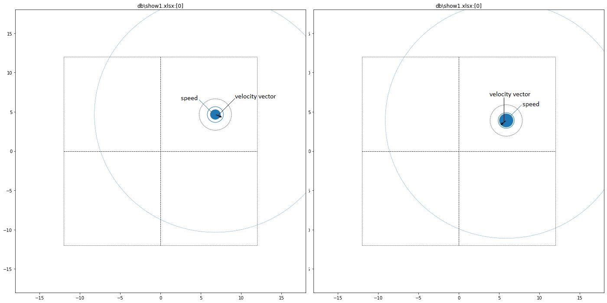


# Sensor Data

> Sensor can be a device like range-finder, distance-sensor, lidar, radar, sonar, depth-camera

* Sensor in fat-bot simulates 2 types of sensors:
    * X-ray : can detect center and boundary of all bots within its scan-distance (occlusion clearly detectable)
    * D-ray : (distance-ray) a simple range-finder device


# Robot's View

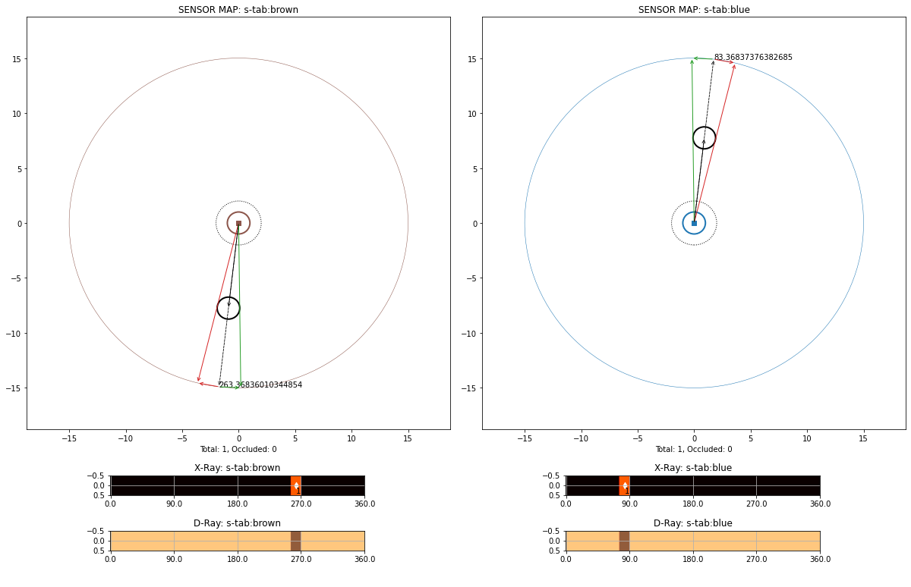
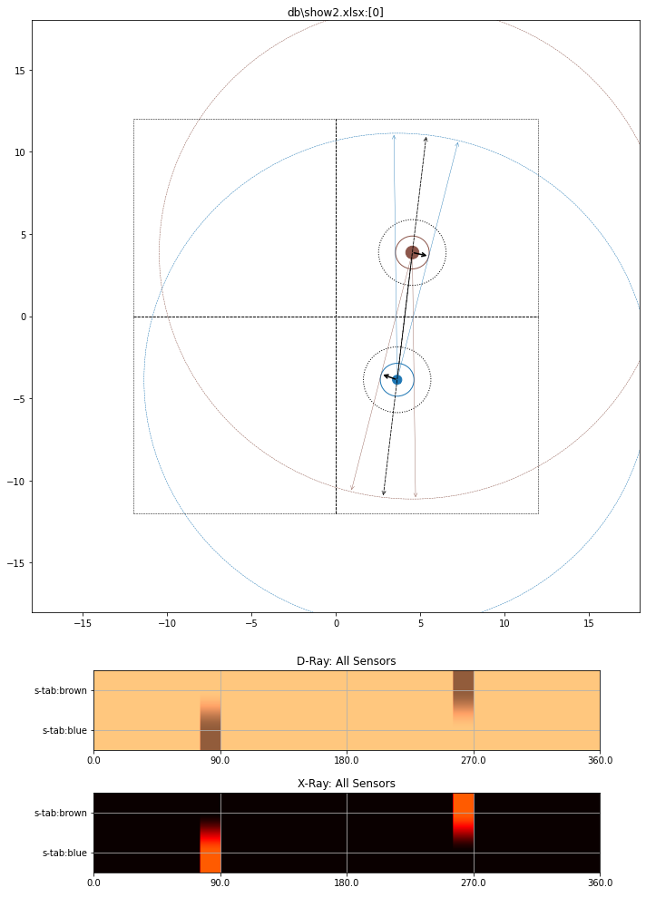

# Visibility Model

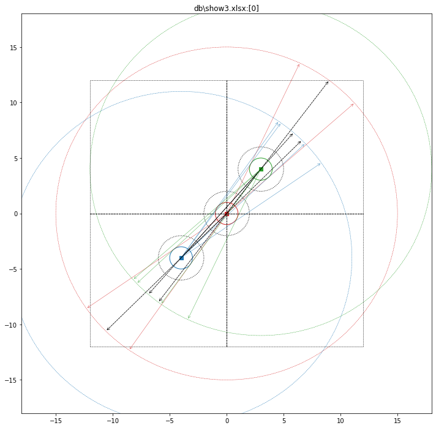

# Sensor Data for Occluded bots

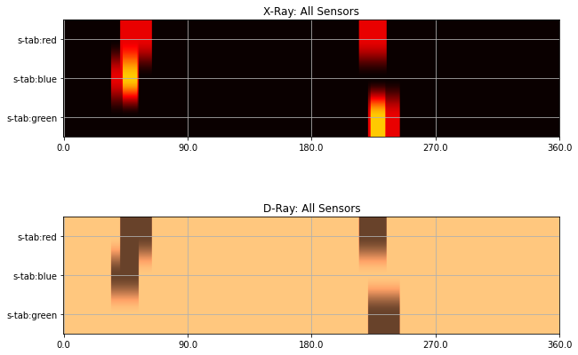

### Red-Bot: all neighbours fully visible

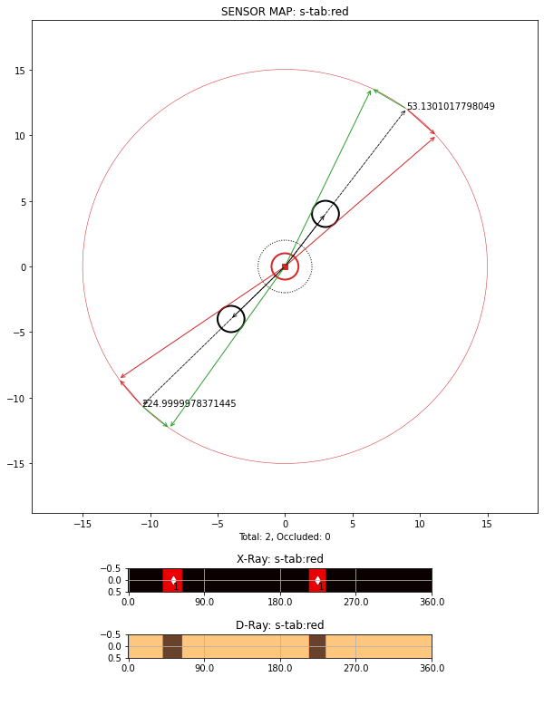

### Blue-Bot: Occlusion Detected

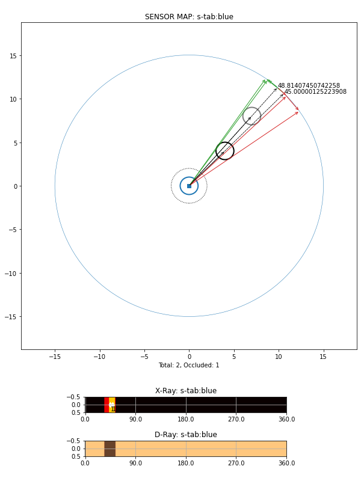

### Green-Bot: Occlusion Detected

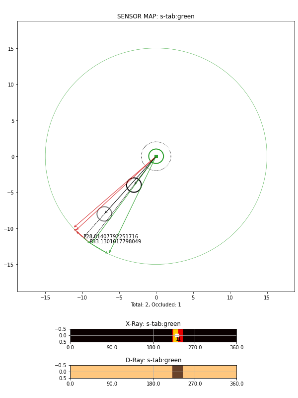

## All Fully Visible

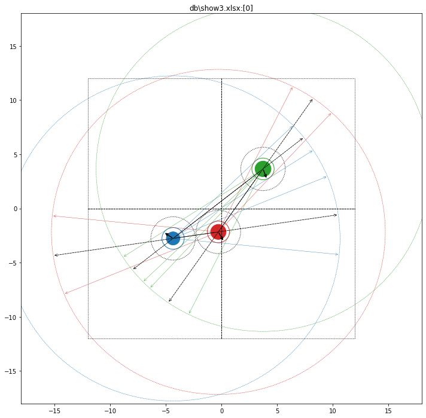
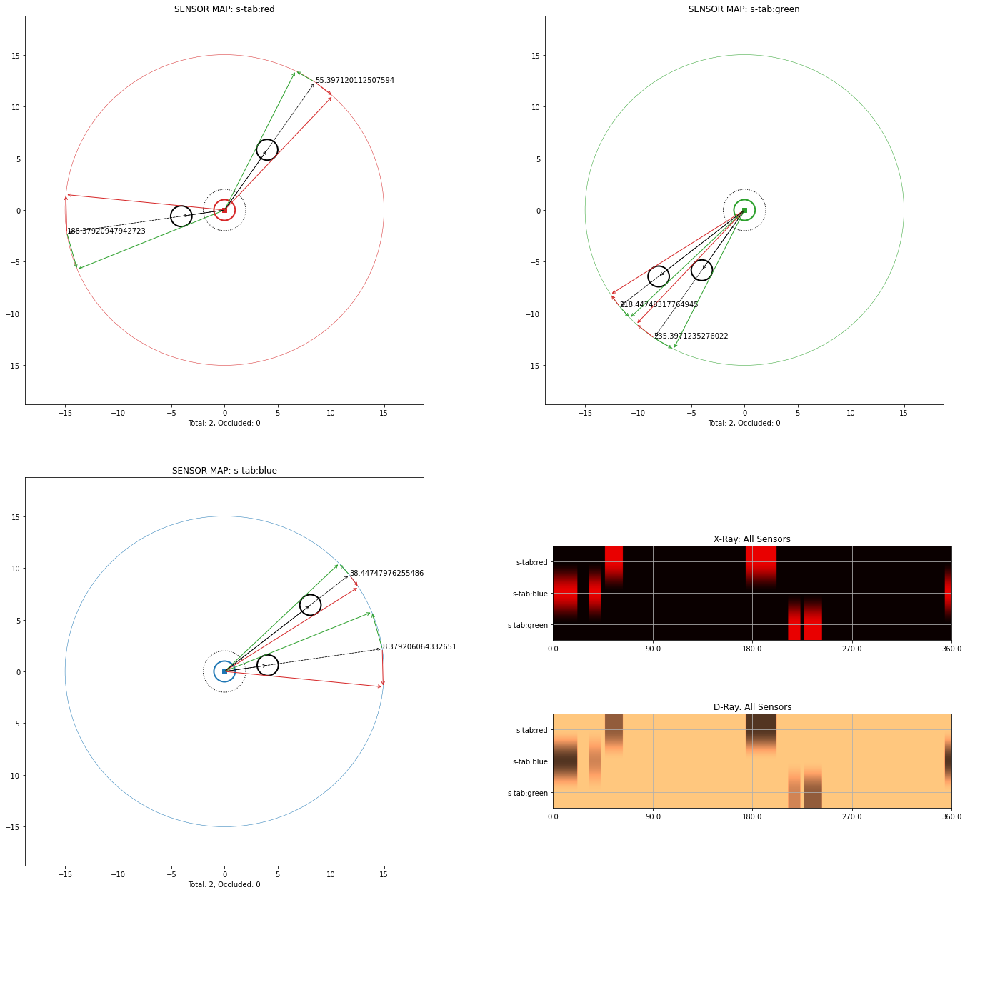


# Training with Gym StableBaselines3


```
render_modes=[ 'all', 'env', 'rew', 'xray', 'xray_', 'dray', 'dray_', 'sen_' ]
```


# for env check

```
runfile('C:/qpdb/alpha/_code/base_fatbot/show.py', 
        wdir='C:/qpdb/alpha/_code/base_fatbot', 
        args='--xls=show1.xlsx --delta=0 --horizon=3 --alive=0 --episodes=1 --render=env,xray,dray,xray_,dray_,sen_')

runfile('C:/qpdb/alpha/_code/base_fatbot/show.py', 
        wdir='C:/qpdb/alpha/_code/base_fatbot', 
        args='--xls=show2.xlsx --delta=0 --horizon=3 --alive=0 --episodes=1 --render=env,xray,dray,xray_,dray_,sen_')

runfile('C:/qpdb/alpha/_code/base_fatbot/show.py', 
        wdir='C:/qpdb/alpha/_code/base_fatbot', 
        args='--xls=show3.xlsx --delta=0 --horizon=3 --alive=0 --episodes=1 --render=env,xray,dray,xray_,dray_,sen_')
```


# for testing/simulation (world)


```
runfile('C:/qpdb/alpha/_code/base_fatbot/runenv.py', 
        wdir='C:/qpdb/alpha/_code/base_fatbot', 
        args='--xls=world.xlsx --horizon=1 --alive=0 --episodes=1 --render=env')


runfile('C:/qpdb/alpha/_code/base_fatbot/runenv.py', 
        wdir='C:/qpdb/alpha/_code/base_fatbot', 
        args='--xls=world.xlsx --horizon=10 --alive=0 --episodes=1 --render=all')


runfile('C:/qpdb/alpha/_code/base_fatbot/runenv.py', 
        wdir='C:/qpdb/alpha/_code/base_fatbot', 
        args='--xls=world.xlsx --horizon=500 --alive=0 --episodes=1 --policy=td3 --render=env')

runfile('C:/qpdb/alpha/_code/base_fatbot/runenv.py', 
        wdir='C:/qpdb/alpha/_code/base_fatbot', 
        args='--xls=world.xlsx --horizon=200 --alive=0 --episodes=1 --policy=ppo --deterministic=1 --render=all')
```


# for training (world)

```
runfile('C:/qpdb/alpha/_code/base_fatbot/traingym.py', 
        wdir='C:/qpdb/alpha/_code/base_fatbot', 
        args='--xls=world.xlsx --horizon=500 --timesteps=100_000 --save_as=td3')

runfile('C:/qpdb/alpha/_code/base_fatbot/traingym.py', 
        wdir='C:/qpdb/alpha/_code/base_fatbot', 
        args='--xls=world.xlsx --horizon=50 --timesteps=10_000 --save_as=td3')


runfile('C:/qpdb/alpha/_code/base_fatbot/traingym.py', 
        wdir='C:/qpdb/alpha/_code/base_fatbot', 
        args='--xls=world.xlsx --horizon=10 --timesteps=100 --save_as=td3')
		
runfile('C:/qpdb/alpha/_code/base_fatbot/traingym.py', 
        wdir='C:/qpdb/alpha/_code/base_fatbot', 
        args='--xls=world.xlsx --horizon=500 --timesteps=100_000 --save_as=ppo')
		
```		

# world2


```
runfile('C:/qpdb/alpha/_code/base_fatbot/runenv.py', 
        wdir='C:/qpdb/alpha/_code/base_fatbot', 
        args='--xls=world2.xlsx --horizon=1 --alive=0 --episodes=1 --render=env')


runfile('C:/qpdb/alpha/_code/base_fatbot/traingym.py', 
        wdir='C:/qpdb/alpha/_code/base_fatbot', 
        args='--xls=world2.xlsx --horizon=500 --timesteps=100_000 --save_as=ppo2')

runfile('C:/qpdb/alpha/_code/base_fatbot/runenv.py', 
        wdir='C:/qpdb/alpha/_code/base_fatbot', 
        args='--xls=world2.xlsx --horizon=100 --alive=0 --episodes=1 --policy=ppo2 --deterministic=1 --render=all')


```


# world3


```
runfile('C:/qpdb/alpha/_code/base_fatbot/runenv.py', 
        wdir='C:/qpdb/alpha/_code/base_fatbot', 
        args='--xls=world3.xlsx --horizon=1 --alive=0 --episodes=1 --render=env')

runfile('C:/qpdb/alpha/_code/base_fatbot/traingym.py', 
        wdir='C:/qpdb/alpha/_code/base_fatbot', 
        args='--xls=world3.xlsx --horizon=500 --timesteps=200_000 --save_as=ppo3')


runfile('C:/qpdb/alpha/_code/base_fatbot/runenv.py', 
        wdir='C:/qpdb/alpha/_code/base_fatbot', 
        args='--xls=world3.xlsx --horizon=100 --alive=0 --episodes=1 --policy=ppo3 --deterministic=1 --render=all')

```


# world4


```

runfile('C:/qpdb/alpha/_code/base_fatbot/runenv.py', 
        wdir='C:/qpdb/alpha/_code/base_fatbot', 
        args='--xls=world4.xlsx --horizon=1 --alive=0 --episodes=1 --render=env')


runfile('C:/qpdb/alpha/_code/base_fatbot/traingym.py', 
        wdir='C:/qpdb/alpha/_code/base_fatbot', 
        args='--xls=world4.xlsx --horizon=500 --timesteps=200_000 --save_as=ppo4')

runfile('C:/qpdb/alpha/_code/base_fatbot/runenv.py', 
        wdir='C:/qpdb/alpha/_code/base_fatbot', 
        args='--xls=world4.xlsx --horizon=100 --alive=0 --episodes=1 --policy=ppo4 --deterministic=1 --render=all')


```

# OCCLUSION


```


runfile('C:/qpdb/alpha/_code/base_fatbot/runenv.py', 
        wdir='C:/qpdb/alpha/_code/base_fatbot', 
        args='--xls=show6.xlsx --horizon=1 --alive=2 --episodes=1 --render=env')


runfile('C:/qpdb/alpha/_code/base_fatbot/runenv.py', 
        wdir='C:/qpdb/alpha/_code/base_fatbot', 
        args='--xls=show6.xlsx --horizon=3 --alive=2 --episodes=1 --render=all,sen_')


runfile('C:/qpdb/alpha/_code/base_fatbot/traingym.py', 
        wdir='C:/qpdb/alpha/_code/base_fatbot', 
        args='--xls=show6.xlsx --horizon=300 --timesteps=200_000 --save_as=ppo6')

runfile('C:/qpdb/alpha/_code/base_fatbot/runenv.py', 
        wdir='C:/qpdb/alpha/_code/base_fatbot', 
        args='--xls=show6.xlsx --horizon=300 --alive=0 --episodes=1 --policy=ppo6 --deterministic=1 --render=all')

```


# world22


```

runfile('C:/qpdb/alpha/_code/base_fatbot/traingym.py', 
        wdir='C:/qpdb/alpha/_code/base_fatbot', 
        args='--xls=world2.xlsx --horizon=500 --timesteps=200_000 --save_as=ppo22')

runfile('C:/qpdb/alpha/_code/base_fatbot/runenv.py', 
        wdir='C:/qpdb/alpha/_code/base_fatbot', 
        args='--xls=world2.xlsx --horizon=500 --alive=0 --episodes=1 --policy=ppo22 --deterministic=1 --render=all')

```


# world44


```
runfile('C:/qpdb/alpha/_code/base_fatbot/runenv.py', 
        wdir='C:/qpdb/alpha/_code/base_fatbot', 
        args='--xls=show4.xlsx --horizon=1 --alive=0 --episodes=1 --render=all,sen_')


runfile('C:/qpdb/alpha/_code/base_fatbot/traingym.py', 
        wdir='C:/qpdb/alpha/_code/base_fatbot', 
        args='--xls=show4.xlsx --horizon=400 --timesteps=200_000 --save_as=ppo44')

runfile('C:/qpdb/alpha/_code/base_fatbot/runenv.py', 
        wdir='C:/qpdb/alpha/_code/base_fatbot', 
        args='--xls=show4.xlsx --horizon=300 --alive=0 --episodes=1 --policy=ppo44 --deterministic=1 --render=all')
```


