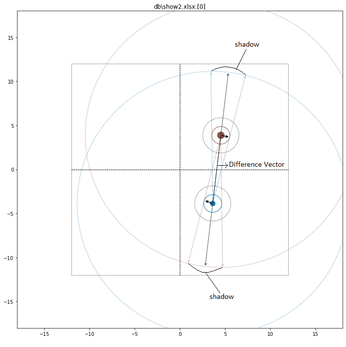
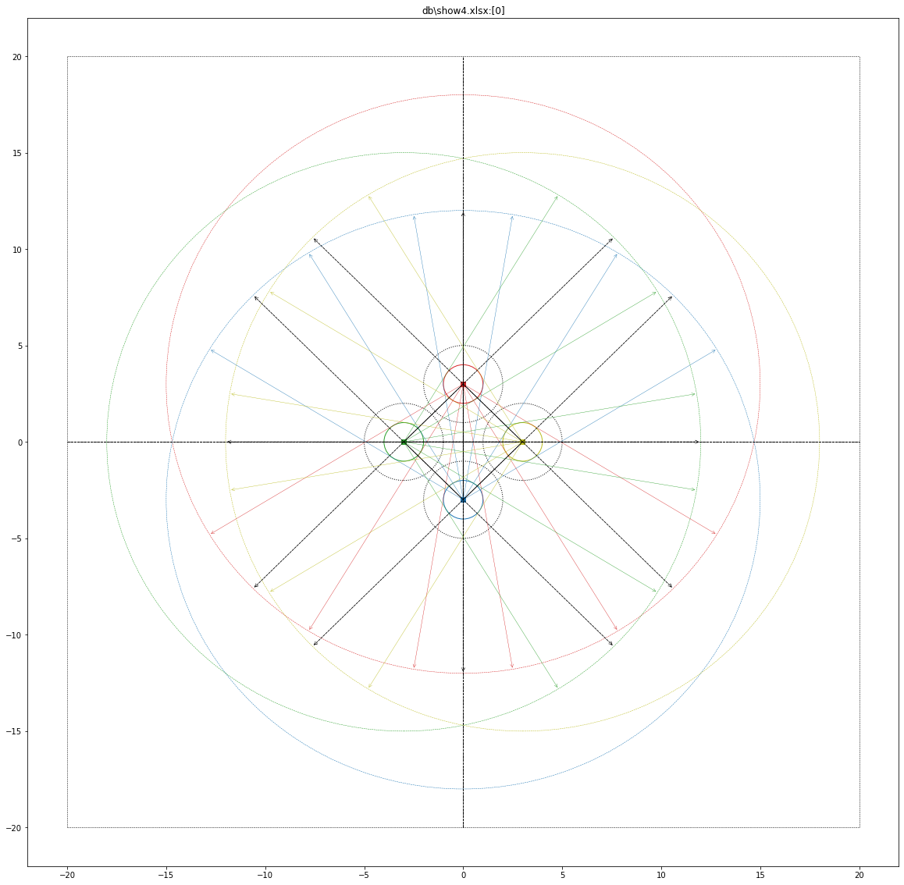
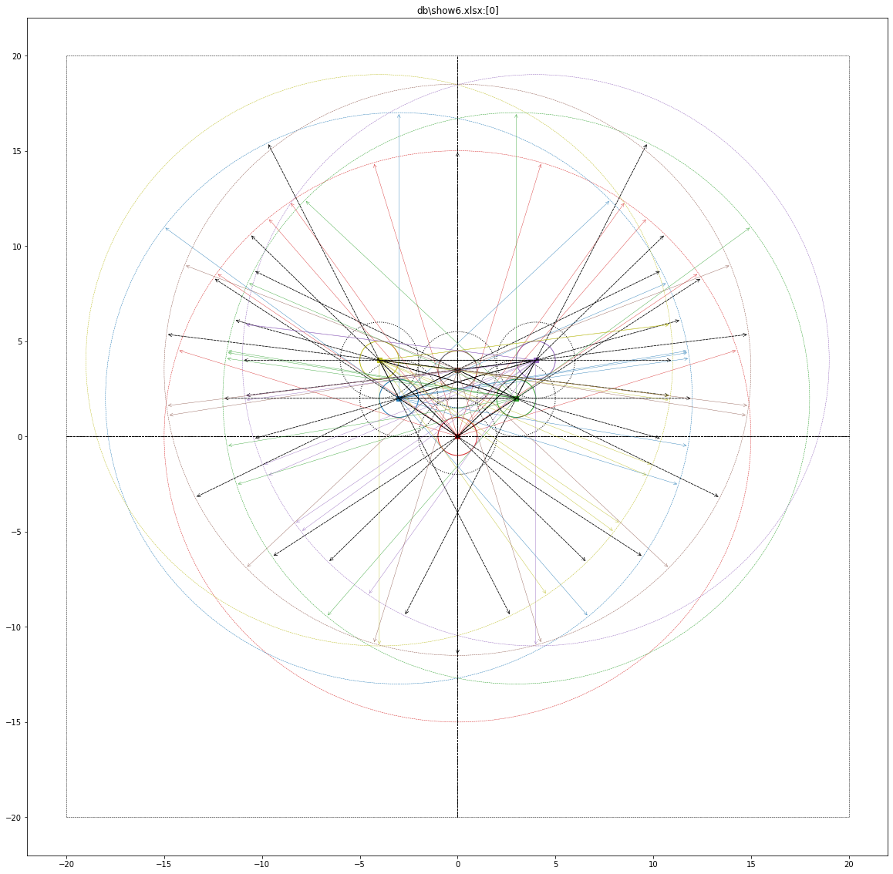
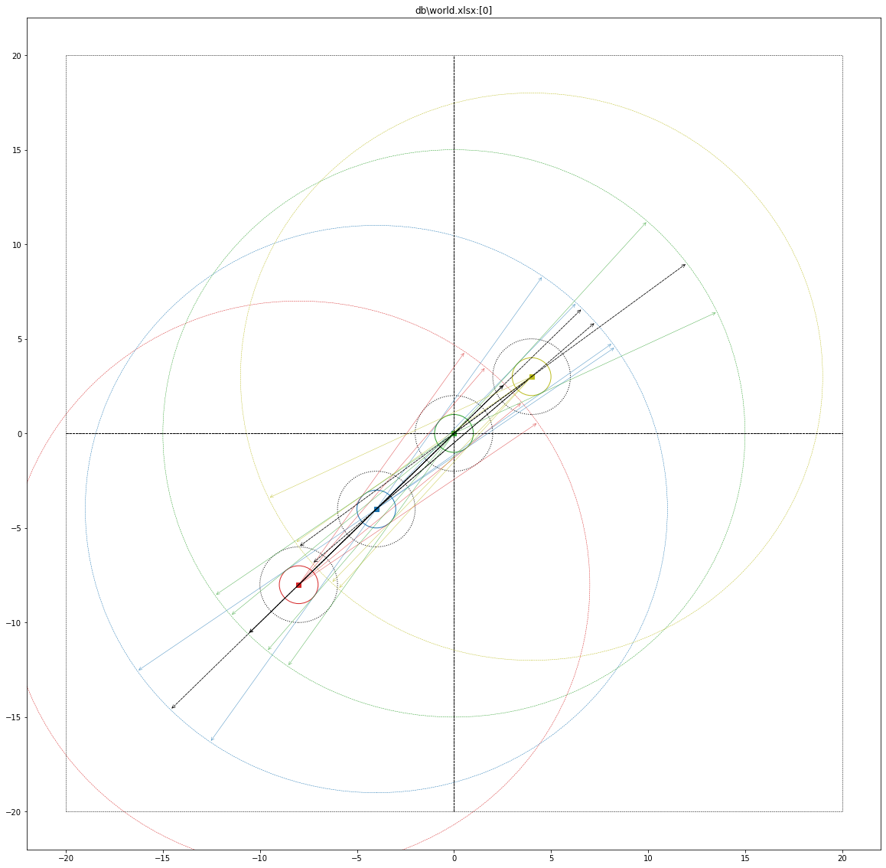
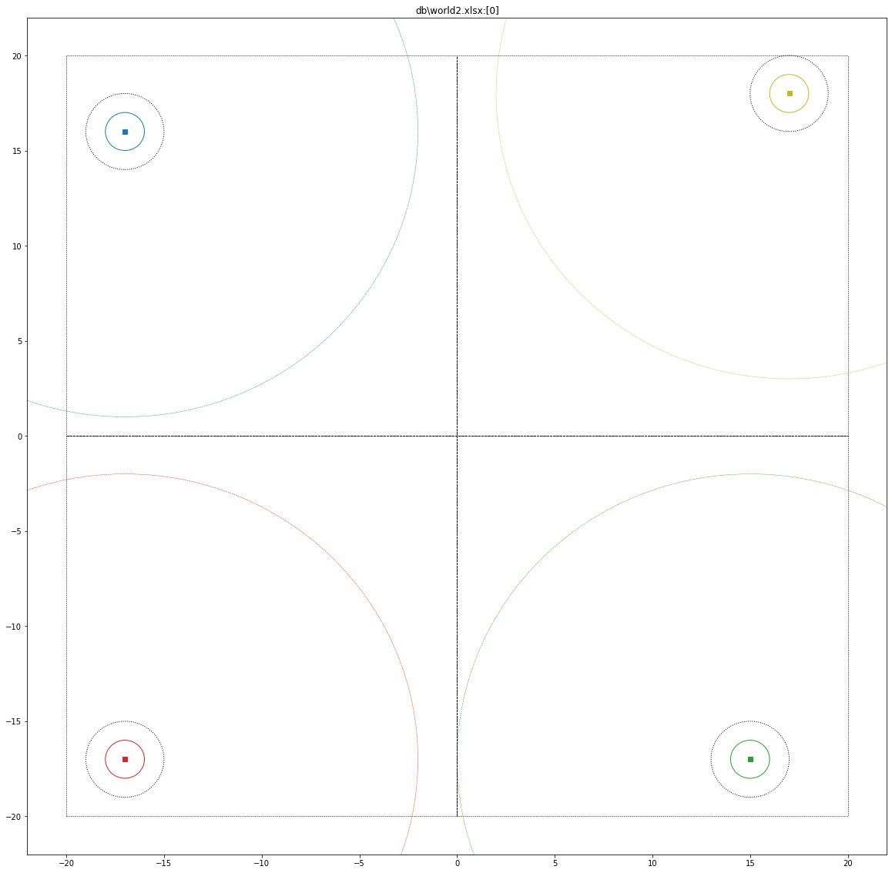
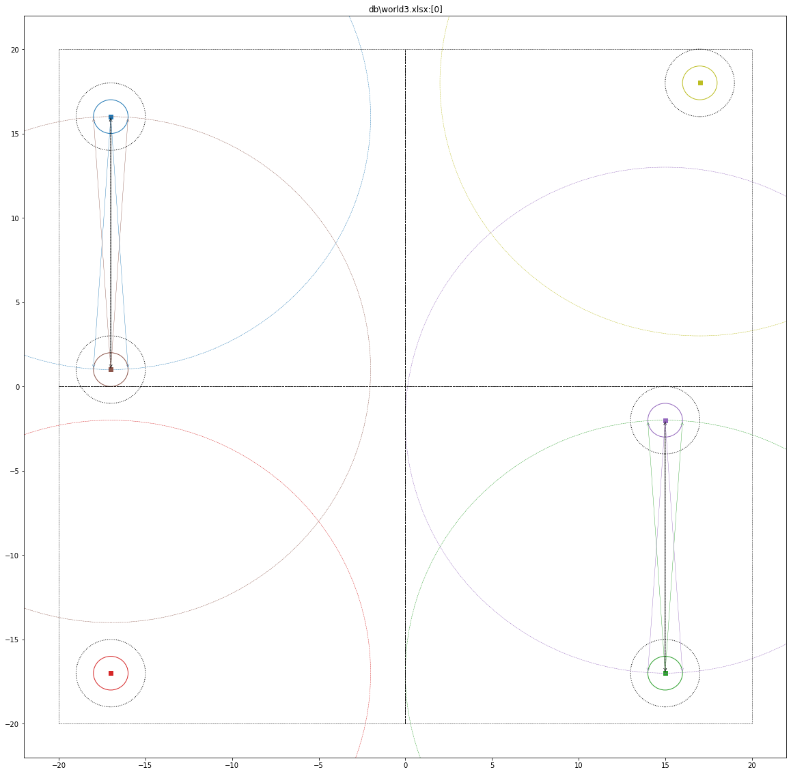
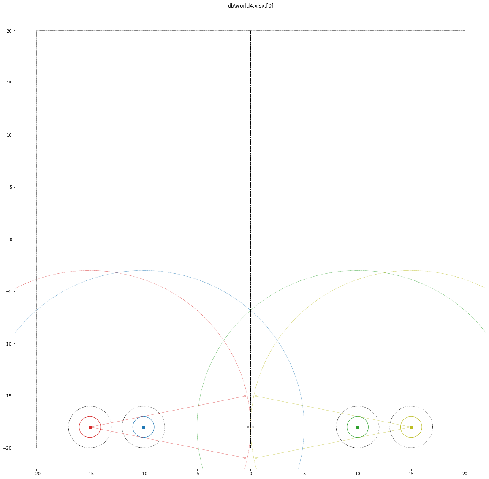

# Fat-Bots in 2D 

> A gym like environment for fat-robots in a 2-D world.

### Sample World with 4 bots

https://github.com/Nelson-iitp/fatbot/blob/main/fig/vid_ppo_world_x4_1.mp4

<video controls>
  <source src="fig/vid_ppo_world_x4_1.mp4" type="video/mp4">
</video>

### Sample World with 5 bots
<video controls>
  <source src="fig/vid_ppo_world_x5_1.mp4" type="video/mp4">
</video>

### Sample World with 6 bots
<video controls>
  <source src="fig/vid_ppo_world_x6_1.mp4" type="video/mp4">
</video>

# World

# Movement Model - Velocity and Speed

# Sensor Data

> Sensor can be a device like range-finder, distance-sensor, lidar, radar, sonar, depth-camera

* Sensor in fat-bot simulates 2 types of sensors:
    * X-ray : can detect center and boundary of all bots within its scan-distance (occlusion clearly detectable)
    * D-ray : (distance-ray) a simple range-finder device

# Robot's View

# Visibility Model

# Sensor Data for Occluded bots

### Red-Bot: all neighbours fully visible

### Blue-Bot: Occlusion Detected

### Green-Bot: Occlusion Detected

## All Fully Visible

# Prebuilt Worlds

