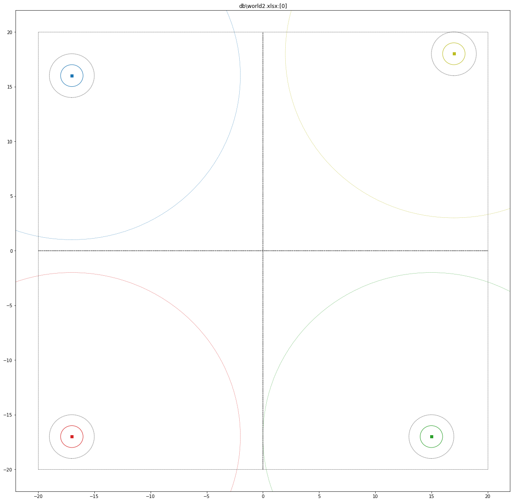

# Training with Gym StableBaselines3


```
render_modes=[ 'all', 'env', 'rew', 'xray', 'xray_', 'dray', 'dray_', 'sen_' ]
```

# for testing/simulation (world)


# Render Env only - n Step

```
runfile('C:/qpdb/alpha/_github/fatbot/src/runenv.py', wdir='C:/qpdb/alpha/_github/fatbot/src', 
        args='--xls=world.xlsx --horizon=1 --alive=0 --episodes=1 --render=env')

```

# Training Policy

```
runfile('C:/qpdb/alpha/_github/fatbot/src/traingym.py', wdir='C:/qpdb/alpha/_github/fatbot/src', 
        args='--xls=world.xlsx --horizon=500 --timesteps=100_000 --save_as=ppo')
```

# Testing Policy

```
runfile('C:/qpdb/alpha/_github/fatbot/src/runenv.py', wdir='C:/qpdb/alpha/_github/fatbot/src', 
        args='--xls=world.xlsx --horizon=200 --alive=0 --episodes=1 --policy=ppo --deterministic=1 --render=all')
```


	

# world2 : ppo2



```
runfile('C:/qpdb/alpha/_github/fatbot/src/runenv.py', 
        wdir='C:/qpdb/alpha/_github/fatbot/src', 
        args='--xls=world2.xlsx --horizon=1 --alive=0 --episodes=1 --render=env')


runfile('C:/qpdb/alpha/_github/fatbot/src/traingym.py', 
        wdir='C:/qpdb/alpha/_github/fatbot/src', 
        args='--xls=world2.xlsx --horizon=500 --timesteps=100_000 --save_as=ppo2')

runfile('C:/qpdb/alpha/_github/fatbot/src/runenv.py', 
        wdir='C:/qpdb/alpha/_github/fatbot/src', 
        args='--xls=world2.xlsx --horizon=100 --alive=0 --episodes=1 --policy=ppo2 --deterministic=1 --render=all')


```


# world3 : ppo3


```
runfile('C:/qpdb/alpha/_github/fatbot/src/runenv.py', 
        wdir='C:/qpdb/alpha/_github/fatbot/src', 
        args='--xls=world3.xlsx --horizon=1 --alive=0 --episodes=1 --render=env')

runfile('C:/qpdb/alpha/_github/fatbot/src/traingym.py', 
        wdir='C:/qpdb/alpha/_github/fatbot/src', 
        args='--xls=world3.xlsx --horizon=500 --timesteps=200_000 --save_as=ppo3')

runfile('C:/qpdb/alpha/_github/fatbot/src/runenv.py', 
        wdir='C:/qpdb/alpha/_github/fatbot/src', 
        args='--xls=world3.xlsx --horizon=100 --alive=0 --episodes=1 --policy=ppo3 --deterministic=1 --render=all')

```


# world4 : ppo4


```

runfile('C:/qpdb/alpha/_github/fatbot/src/runenv.py', 
        wdir='C:/qpdb/alpha/_github/fatbot/src', 
        args='--xls=world4.xlsx --horizon=1 --alive=0 --episodes=1 --render=env')

runfile('C:/qpdb/alpha/_github/fatbot/src/traingym.py', 
        wdir='C:/qpdb/alpha/_github/fatbot/src', 
        args='--xls=world4.xlsx --horizon=500 --timesteps=200_000 --save_as=ppo4')

runfile('C:/qpdb/alpha/_github/fatbot/src/runenv.py', 
        wdir='C:/qpdb/alpha/_github/fatbot/src', 
        args='--xls=world4.xlsx --horizon=100 --alive=0 --episodes=1 --policy=ppo4 --deterministic=1 --render=all')


```

# OCCLUSION


## world : show6


```


runfile('C:/qpdb/alpha/_github/fatbot/src/runenv.py', 
        wdir='C:/qpdb/alpha/_github/fatbot/src', 
        args='--xls=show6.xlsx --horizon=1 --alive=2 --episodes=1 --render=env')


runfile('C:/qpdb/alpha/_github/fatbot/src/runenv.py', 
        wdir='C:/qpdb/alpha/_github/fatbot/src', 
        args='--xls=show6.xlsx --horizon=3 --alive=2 --episodes=1 --render=all,sen_')


runfile('C:/qpdb/alpha/_github/fatbot/src/traingym.py', 
        wdir='C:/qpdb/alpha/_github/fatbot/src', 
        args='--xls=show6.xlsx --horizon=300 --timesteps=200_000 --save_as=ppo6')

runfile('C:/qpdb/alpha/_github/fatbot/src/runenv.py', 
        wdir='C:/qpdb/alpha/_github/fatbot/src', 
        args='--xls=show6.xlsx --horizon=300 --alive=0 --episodes=1 --policy=ppo6 --deterministic=1 --render=all')

```

## world : show4


```
runfile('C:/qpdb/alpha/_github/fatbot/src/runenv.py', 
        wdir='C:/qpdb/alpha/_github/fatbot/src', 
        args='--xls=show4.xlsx --horizon=1 --alive=0 --episodes=1 --render=all,sen_')


runfile('C:/qpdb/alpha/_github/fatbot/src/traingym.py', 
        wdir='C:/qpdb/alpha/_github/fatbot/src', 
        args='--xls=show4.xlsx --horizon=400 --timesteps=200_000 --save_as=ppo44')

runfile('C:/qpdb/alpha/_github/fatbot/src/runenv.py', 
        wdir='C:/qpdb/alpha/_github/fatbot/src', 
        args='--xls=show4.xlsx --horizon=300 --alive=0 --episodes=1 --policy=ppo44 --deterministic=1 --render=all')
```


